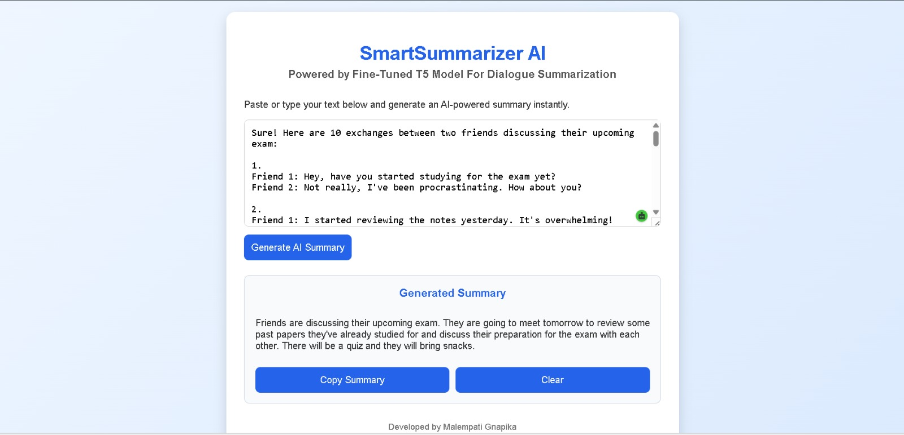

# SmartSummarizer AI

AI-powered Dialogue Summarization web application built using a Fine-Tuned T5 Transformer and FastAPI.

---

## 📌 Overview

SmartSummarizer AI generates concise summaries from multi-turn conversations using a Fine-Tuned T5 Transformer trained on the SAMSum dialogue dataset. The application provides a simple web interface for entering conversations and instantly generating abstractive summaries.

---

## ✨ Features
- Dialogue summarization using a Fine-Tuned T5 Transformer
- FastAPI backend for real-time inference
- Automatic text preprocessing
- Responsive web interface
- Copy generated summary with one click
- Clean and user-friendly UI

---

## 🛠 Tech Stack

### Backend
- Python
- FastAPI
- PyTorch
- Hugging Face Transformers
- Pydantic

### Frontend
- HTML
- CSS
- JavaScript

### Model
- Fine-Tuned T5 Transformer
- SAMSum Dialogue Dataset

---

## 📂 Project Structure
```
Dialogue_Summarization_T5/
│
├── app.py
├── index.html
├── requirements.txt
├── README.md
├── .gitignore
│
├── src/
│   ├── preprocess.py
│   └── train.py
│
├── data/
│   ├── samsum-train.csv
│   ├── samsum-validation.csv
│   └── samsum-test.csv
│
└── saved_summary_model/
```

---

## Workflow

```
Dialogue Input
      │
      ▼
Text Preprocessing
      │
      ▼
Tokenization
      │
      ▼
Fine-Tuned T5 Model
      │
      ▼
Summary Generation
      │
      ▼
Display Summary
```

---

## ⚙ Installation

Clone the repository

```bash
git clone https://github.com/MalempatiGnapika/Dialogue_Summarization_T5.git
```

Move into the project

```bash
cd Dialogue_Summarization_T5
```

Install dependencies

```bash
pip install -r requirements.txt
```

Run the application

```bash
uvicorn app:app --reload
```

Open your browser

```
http://127.0.0.1:8000
```

---

## 📸 Screenshots
<p align="center">
  
</p>


## Note

The trained model weights are not included in this repository because they exceed GitHub's file size limit. Train the model using `src/train.py` or place the trained model inside the `saved_summary_model` directory before running the application.

---

## 👩‍💻 Author
**Malempati Gnapika**

B.E. Computer Science Engineering

GitHub: https://github.com/MalempatiGnapika

